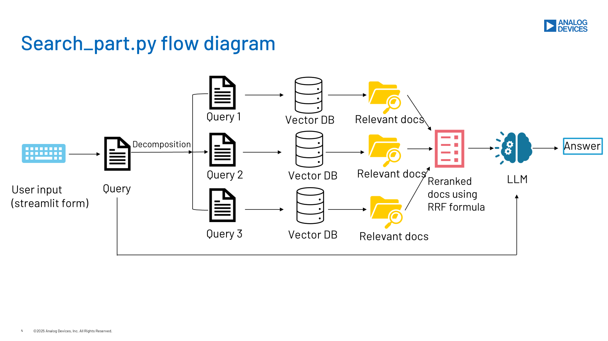
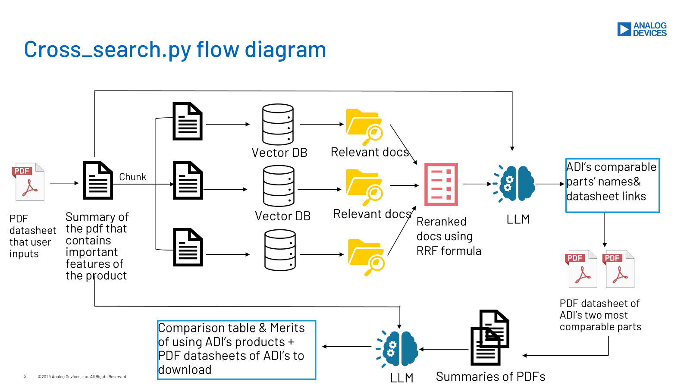

# Analog Assist
This repository contains a GenAI-powered application built using **LangChain**  as the main framework and **Streamlit** for GUI development. 

## Features

- **Product Search Tool**: Enter the necessary information, the tool recommends suitable ADI products that meet the customer's needs.
- **Cross Reference Search**: Upload a competitor's datasheet, the tool suggests ADI products with the same or similar specifications.


## Installation and run

To run the app locally, follow these steps:

1. Clone this repository:
   ```bash
   git clone https://github.com/Anh-Do_adi/ChocoMango
   cd ChocoMango
   ```

2. Install dependencies:
   ```bash
   pip install -r requirements.txt
   ```

3. Run the app:
   ```bash
   streamlit run .\homepage.py
   ```

## Usage

### Feature 1: Product Search Tool
- Enter your query in the form. Only the Application/Purpose field is required, other fields are optional. But the LLM's accuracy can be imrpoved if these fields' information is provided.
- Analog Assist processes your input and generates a PST.

#### Input Fields

| Field | Description |
|--------|-------------|
| Application/Purpose | Describe your intended use case |
| Category | Select a product category from the dropdown list |
| Min Voltage | Specify the minimum operating voltage |
| Max Voltage | Specify the maximum operating voltage |
| Supply Current Max Limit | Define the maximum allowable supply current |
| Min Temperature Range | Set the minimum operating temperature |
| Max Temperature Range | Set the maximum operating temperature |
| Package | Define the preferred package type |
| Other Requirements | Additional constraints or preferences |

### Feature 2: Cross Reference Search
- THe user uploads a competitor's datasheet.
- Analog Assist analyzes the datasheet and provides top 2 most comparables products.
- You can also download the corresponding ADI datasheet simultaneously.

## Backend code flow Diagram
The following diagram illustrates the workflow of the application:





## Requirements

- Python 3.11.x
- OpenAI API Key (LLM: gpt-4o-mini, Embedding: text-embedding-3-large)
- Pinecone Vector DB
